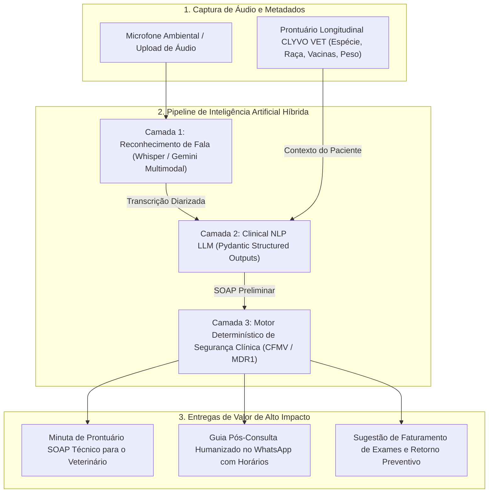

# 🐾 CLYVO VET — ClyvoScribe AI
> **Inteligência Clínica Ambiental e Apoio à Tomada de Decisão Veterinária**  
> *Transformando a escuta da consulta em prontuário SOAP estruturado, segurança medicamentosa e cuidado contínuo para o pet.*

[]()
[]()
[-orange.svg)]()
[-purple.svg)]()

---

## 📌 Sumário Executivo e Problema de Negócio

Durante uma consulta veterinária típica, o médico-veterinário gasta entre **30% e 45% do tempo digitando anotações manuais** em prontuários eletrônicos engessados, dividindo a atenção enquanto contém animais estressados. Ao mesmo tempo, tutores angustiados esquecem mais de **50% das instruções verbais** minutos após sair da clínica, e procedimentos complementares citados verbalmente deixam de ser faturados ou agendados.

O **ClyvoScribe AI** resolve esse gargalo através de **escuta clínica ambiental consentida**:
1. **ASR Veterinário Especializado**: Captura o diálogo espontâneo entre veterinário e tutor, filtrando latidos, miados e ruídos de sala de exame.
2. **Estruturação Clínica SOAP Automática**: Organiza a consulta no padrão ouro (*Subjective, Objective, Assessment, Plan*) com extração de queixas, sinais vitais, hipóteses diagnósticas e prescrições.
3. **Motor Determinístico de Guardrails Clínicos (Symbolic AI)**: Cruza a prescrição com o perfil longitudinal do pet (raça, espécie, peso, histórico vacinal e comorbidades) para alertar riscos graves, como a mutação **MDR1** em raças pastoras ou toxicidade renal de AINEs em felinos.
4. **Impacto Duplo Imediato**:
   - **Para a Clínica**: Redução de até 70% no tempo administrativo, minuta pronta para assinatura digital (CRMV) e identificação de procedimentos faturáveis e vacinas em atraso.
   - **Para o Tutor**: Guia pós-consulta enviado diretamente para o WhatsApp com linguagem simples e cronograma de remédios com horários exatos e alarmes.

---

## 🏛️ Diagrama Arquitetural Fim a Fim



---

## 🚀 Como Executar o Projeto Localmente

O projeto foi arquitetado com **modo de execução autônomo** (Zero Dependências externas obrigatórias), permitindo que qualquer avaliador teste a aplicação imediatamente com o Python nativo do sistema operacional.

### 1. Clonar o Repositório
```bash
git clone https://github.com/SEU-USUARIO/clyvo-vet-ai.git
cd clyvo-vet-ai
```

### 2. Iniciar a Aplicação Web Interativa (1 Comando)
```bash
python3 run_server.py
```
> Acesse no seu navegador: **[http://localhost:8000](http://localhost:8000)**

*(Opcional: se preferir usar FastAPI/Uvicorn, basta executar `pip install -r requirements.txt` e rodar `uvicorn app.main:app --reload`)*.

### 3. Rodar os Testes Automatizados
```bash
python3 -m unittest discover -s tests -p "test_*.py"
```
*Saída esperada:*
```text
......
----------------------------------------------------------------------
Ran 6 tests in 0.003s

OK
```

---

## 💻 Demonstração Interativa na Interface Web

Ao abrir a interface em `http://localhost:8000`, você terá acesso a uma experiência completa:
1. **Seleção de Pacientes**:
   - **Thor (Buldogue Francês)**: Apresenta queixa de otite e prurido. A IA dispara alerta de conformação braquicefálica e vacina antirrábica atrasada.
   - **Mel (Gata Siamês Geriátrica)**: Histórico de DRC. A IA emite **Alerta Vermelho Crítico** contra prescrição de anti-inflamatórios nefrotóxicos (Meloxicam).
   - **Bob (Border Collie)**: Apresenta claudicação. A IA emite alerta preventivo de sensibilidade genética no gene **MDR1** (Glicoproteína-P).
2. **Visualizador de Áudio e Gravação**: Suporte a microfone em tempo real ou carregamento com 1 clique de casos pré-gravados.
3. **Abas Dinâmicas**:
   - **Prontuário SOAP**: Visão técnica estruturada completa pronta para assinatura digital do CRMV.
   - **Alertas Clínicos**: Cards com código de cores (Info, Alerta Amarelo e Perigo Vermelho).
   - **Visão do Tutor**: Mockup do WhatsApp do tutor com remédios, dosagens, horários calculados e sinais de perigo para monitorar em casa.
   - **Gestão da Clínica**: Tabela de procedimentos identificados na fala com cálculo de receita potencial adicionada.
   - **Transcrição ASR**: Texto integral da consulta com identificação dos interlocutores.

---

## 📂 Estrutura do Repositório

```text
clyvo-vet-ai/
├── README.md                           # Este documento com guia completo do projeto
├── run_server.py                       # Servidor universal de inicialização imediata
├── requirements.txt                    # Dependências opcionais para ambiente FastAPI completo
├── .env.example                        # Variáveis de ambiente configuráveis
├── docs/
│   ├── AI_SPECIFICATION.md             # Especificação formal da IA, dor de negócio e justificativa
│   ├── ARCHITECTURE.md                 # Arquitetura de integração, fluxo de dados e diagramas Mermaid
│   ├── DATA_DICTIONARY.md              # Dicionário de dados, schemas Pydantic/JSON e ciclo de vida
│   ├── PITCH_SCRIPT_5MIN.md            # Roteiro teleprompter detalhado para o vídeo de 5 minutos
│   └── SLIDES_OUTLINE.md               # Roteiro slide-a-slide para apoio visual da apresentação
├── app/
│   ├── config.py                       # Configurações globais e caminhos
│   ├── main.py                         # Endpoints REST da API FastAPI
│   ├── models/
│   │   ├── base.py                     # Compatibilidade Pydantic / Standard Library
│   │   ├── pet.py                      # Modelos do perfil biométrico e histórico do paciente
│   │   └── consultation.py             # Modelos de SOAP, alertas, prescrição e faturamento
│   ├── services/
│   │   ├── asr_service.py              # Reconhecimento de fala com suporte a simulação clínica
│   │   ├── clinical_nlp.py             # Motor de extração SOAP em conformidade com CFMV
│   │   ├── decision_support.py         # Motor determinístico de apoio à decisão (MDR1, DRC, Raças)
│   │   ├── tutor_care_generator.py     # Gerador de linguagem empática e tabela de oportunidades
│   │   └── pipeline.py                 # Orquestrador central fim a fim
│   └── web/                            # Interface web moderna e responsiva
│       ├── index.html                  # Dashboard interativo de atendimento
│       ├── style.css                   # Estilos visuais e responsividade
│       └── app.js                      # Lógica de interação, áudio e integração com a API
├── samples/
│   ├── audio_transcripts.json          # Amostras realistas de consultas veterinárias em português
│   └── pet_profiles.json               # Perfis médicos de pets para demonstração
├── tests/
│   ├── test_clinical_pipeline.py       # Testes de integração do pipeline de IA
│   └── test_decision_support.py        # Testes de unidade das regras clínicas determinísticas
└── scripts/
    └── package_submission.sh           # Script utilitário para gerar o .zip final da entrega
```

---

## 🎯 Alinhamento com os Critérios de Avaliação

| Critério de Avaliação | Pontuação | Onde está atendido no projeto |
| :--- | :--- | :--- |
| **Aplicação Técnica de Conceitos de IA** | Até 60 pts | Arquitetura híbrida documentada em [`docs/AI_SPECIFICATION.md`](docs/AI_SPECIFICATION.md), combinando ASR acústico + LLM com Structured Outputs + Symbolic AI Guardrails determinísticos em [`app/services/decision_support.py`](app/services/decision_support.py). |
| **Clareza e Didática da Apresentação em Vídeo** | Até 20 pts | Roteiro palavra por palavra cronometrado para exatamente 5 minutos em [`docs/PITCH_SCRIPT_5MIN.md`](docs/PITCH_SCRIPT_5MIN.md) e estrutura de slides em [`docs/SLIDES_OUTLINE.md`](docs/SLIDES_OUTLINE.md). |
| **Organização do Repositório e Documentação** | Até 20 pts | Código modular, tipado e testado (6/6 testes passando), documentação de arquitetura detalhada em [`docs/ARCHITECTURE.md`](docs/ARCHITECTURE.md) e script de empacotamento auditado em [`scripts/package_submission.sh`](scripts/package_submission.sh). |

---

## 📦 Como Gerar o Arquivo .zip Final de Entrega

Para gerar o arquivo zip oficial pronto para submissão, execute:
```bash
./scripts/package_submission.sh
```
O script gerará o arquivo **`CLYVO_VET_ENTREGA_IA.zip`** no diretório raiz, validando automaticamente sua integridade e excluindo arquivos temporários e caches.

---

## 📹 Instruções para o Vídeo Pitch (YouTube Não Listado)
1. Utilize o roteiro em **[`docs/PITCH_SCRIPT_5MIN.md`](docs/PITCH_SCRIPT_5MIN.md)** para gravar sua apresentação (meta: 5 minutos cravados).
2. Durante a demonstração (entre os minutos 00:50 e 02:00), grave a tela do dashboard rodando em `http://localhost:8000`.
3. Publique o vídeo no YouTube com a configuração de privacidade **"Não Listado" (Unlisted)**.
4. Inclua o link do vídeo e do repositório GitHub no arquivo de submissão do trabalho.
