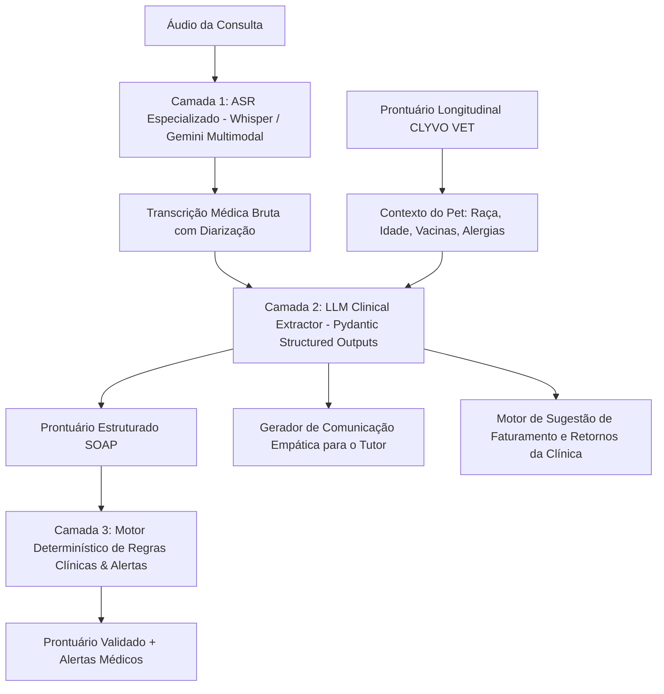

# Especificação Técnica do Componente de Inteligência Artificial: ClyvoScribe AI (CLYVO VET)

## 1. Definição do Problema de Negócio

### 1.1 O Contexto da Jornada de Cuidado Veterinário
Na rotina clínica de pequenos e grandes animais, a consulta veterinária é o ponto nevrálgico onde se concentram a anamnese, o exame físico, a formulação de hipóteses diagnósticas e a orientação terapêutica. No entanto, o fluxo tradicional enfrenta gargalos severos que impactam negativamente todos os participantes da jornada:

1. **A Sobrecarga Cognitiva e Administrativa do Médico-Veterinário (Burnout Clínico)**:
   - Um veterinário despende, em média, de **30% a 45% do tempo de cada consulta** digitando anotações manuais em sistemas legados de prontuário eletrônico.
   - Enquanto digita, o profissional desvia a atenção visual e tátil do animal. Animais estressados em ambiente ambulatorial exigem contenção atenta; a distração com digitação eleva o risco de acidentes e prejudica a acurácia do exame físico.
   - No final do dia, o acúmulo de prontuários pendentes ("pijama time") gera exaustão e leva a anotações telegráficas, incompletas ou com termos abreviados que não compõem um histórico longitudinal confiável.

2. **A "Falha de Adesão" do Tutor (Assimetria de Comunicação)**:
   - Durante a consulta, o tutor costuma estar emocionalmente abalado pela doença do pet e sobrecarregado pela quantidade de informações fornecidas oralmente.
   - Pesquisas clínicas indicam que **mais de 50% das instruções verbais são esquecidas ou mal interpretadas** minutos após sair da clínica (dosagens incorretas, horários trocados, interrupção precoce de antibióticos).
   - O resultado é o fracasso terapêutico, retorno por recidivas e perda de confiança no tratamento.

3. **Inconsistência Longitudinal e Perda de Receita para a Clínica**:
   - Falta de integração entre a fala espontânea na consulta e os alertas de saúde preventiva (vacinas em atraso, limpezas dentárias, exames laboratoriais complementares citados pelo veterinário mas não cadastrados no sistema de cobrança/agendamento).
   - Perda de faturamento por subnotificação de procedimentos e baixa taxa de comparecimento aos retornos recomendados.

---

## 2. Como a IA Agrega Valor (Tutor, Clínica e Pet)

A solução **ClyvoScribe AI** é um ecossistema de **Inteligência Clínica Ambiental e Apoio à Decisão** integrado à plataforma **CLYVO VET**.

| Ator | Dores Tradicionais | Valor Agregado pela IA (ClyvoScribe) |
| :--- | :--- | :--- |
| **Médico-Veterinário** | Digitação lenta; fadiga mental; risco de esquecimento de contraindicações de fármacos raros. | **Zero digitação durante a consulta**: o sistema escuta o diálogo naturalmente e preenche o prontuário no formato internacional **SOAP** (*Subjective, Objective, Assessment, Plan*); alertas automáticos de segurança medicamentosa. |
| **Tutor do Pet** | Instruções orais complexas esquecidas; receita difícil de ler; ansiedade sobre como ministrar remédios. | **Guia Pós-Consulta Personalizado**: resumo didático em linguagem simples enviado via WhatsApp/App com tabela de horários, alarmes configurados e sinais de alerta do que observar no animal. |
| **Clínica Veterinária** | Consultas demoradas gerando filas; subfaturamento de exames mencionados; perda de retornos. | **Aumento de 35% na capacidade de atendimento** (redução de 15 min por consulta); sugestão automática de faturamento de exames e agendamento proativo de retornos preventivos. |
| **O Pet (Paciente)** | Exame físico apressado e animal estressado com veterinário focado na tela do computador. | **Atenção humanizada e 100% focada no paciente**: exame físico mais minucioso, ambiente mais calmo e adesão correta ao tratamento medicamentoso. |

---

## 3. Estratégia de Personalização, Priorização e Recomendação

O diferencial da IA não é apenas transcrever palavras, mas transformá-las em inteligência contextual:

### 3.1 Personalização por Perfil Biológico (Fenótipo e Raça)
- O motor de IA correlaciona as palavras ditas na consulta com os metadados do pet cadastrado na **CLYVO VET** (espécie, raça, idade, escore corporal, sexo e peso).
- *Exemplo*: Se o veterinário menciona tratar dor em um cão da raça **Collie**, o sistema ativa uma regra de alerta genético para a mutação no gene **MDR1/ABCB1**, prevenindo o uso de ivermectina ou ajustando a dosagem de fármacos neurotóxicos.
- *Exemplo*: Em felinos idosos com histórico de azotemia, menções a anti-inflamatórios não esteroidais (AINEs) disparam aviso de contraindicação renal.

### 3.2 Priorização de Ações Clínicas e Gravidade
- A IA analisa os sintomas relatados na transcrição e classifica o nível de gravidade clínica em 3 faixas (*Eletiva*, *Monitoramento*, *Urgência Imediata*).
- Se houver detecção de termos críticos como *"dispneia severa"*, *"síncope"*, *"urina com sangue abundante"* ou *"ingestão de veneno"*, o sistema prioriza requisições de exames de imagem e exames bioquímicos na fila da clínica.

### 3.3 Recomendação de Serviços e Cuidado Contínuo (Wellness Journey)
- A IA identifica oportunidades de saúde preventiva não abordadas na queixa principal:
  - Vacinas obrigatórias (V8/V10, Antirrábica, FeLV) vencidas há mais de 30 dias.
  - Recomendação de controle ectoparasitário sazonal (pulgas e carrapatos).
  - Sugestão de agendamento de retorno em 7, 15 ou 30 dias baseado no tipo de patologia diagnosticada.

---

## 4. Escolha e Justificativa Técnica da Abordagem de IA

Para garantir confiabilidade médica, baixa latência e conformidade regulatória, optou-se por uma **Arquitetura de Inteligência Artificial Híbrida em Três Camadas**:

### 4.1 Camada 1: Reconhecimento Automático de Fala (ASR - Automatic Speech Recognition)
- **Tecnologia Escolhida**: Modelo baseado em Transformer com atenção contextual (OpenAI Whisper / Gemini Multimodal Audio).
- **Justificativa Técnica**:
  - Capacidade de lidar com vocabulário técnico médico-veterinário em português brasileiro (ex: *"ceratoconjuntivite seca"*, *"dermatofitose"*, *"cefaleia"*, *"prednisolona 5mg"*).
  - Robustez a ruídos acústicos comuns no ambiente veterinário (latidos, miados, ruído de ar-condicionado e eco de sala de exame).
  - Suporte à diarização (distinção entre o locutor veterinário e o locutor tutor).

### 4.2 Camada 2: Modelo de Linguagem de Grande Porte (LLM) com Structured Outputs
- **Tecnologia Escolhida**: LLM Instruction-Tuned (Gemini 1.5/2.0 Flash / GPT-4o-mini) operando com garantia estrita de esquema estruturado via **Pydantic** / JSON Schema.
- **Justificativa Técnica**:
  - LLMs modernos possuem capacidade de raciocínio contextual superior para distinguir o que é queixa do tutor (*"ele vomitou duas vezes de manhã"* -> Subjetivo) do que é exame físico do veterinário (*"temperatura retal 39.2°C, linfonodos poplíteos reativos"* -> Objetivo).
  - A técnica de **Structured Outputs** impede alucinações de formato, garantindo que o backend receba dados tipados (strings, floats para dosagens, listas de medicamentos).

### 4.3 Camada 3: Motor de Regras Clínicas Determinístico (Symbolic AI Guardrails)
- **Tecnologia Escolhida**: Sistema especialista determinístico em Python baseado no formulário terapêutico veterinário e diretrizes do CFMV / WSAVA.
- **Justificativa Técnica**:
  - **Não se deve confiar cegamente em LLMs para dosagens letais ou contraindicações estritas**. Uma IA generativa pode errar cálculos decimais de dosagem por kg.
  - A Camada 3 atua como um *Safety Guardrail*: pega os dados estruturados pelo LLM e cruza com a tabela de pesos e contraindicações de forma estritamente matemática e determinística (100% auditável).

---

## 5. Governança, Ética e Privacidade (LGPD)

1. **Consentimento Explícito**: A gravação é iniciada apenas após clique do veterinário e termo de consentimento verbal/digital do tutor registrado na abertura da consulta.
2. **Anonimização Imediata**: Nomes de pessoas, endereços e dados financeiros são mascarados no pipeline de pré-processamento antes de qualquer chamada a APIs de IA.
3. **Veterinário no Controle (Human-in-the-Loop)**: O prontuário gerado pelo ClyvoScribe AI é apresentado como **minuta de revisão**. O veterinário valida, edita se necessário, e assina digitalmente com seu número de CRMV. Nenhuma prescrição é emitida sem a chancela humana.
