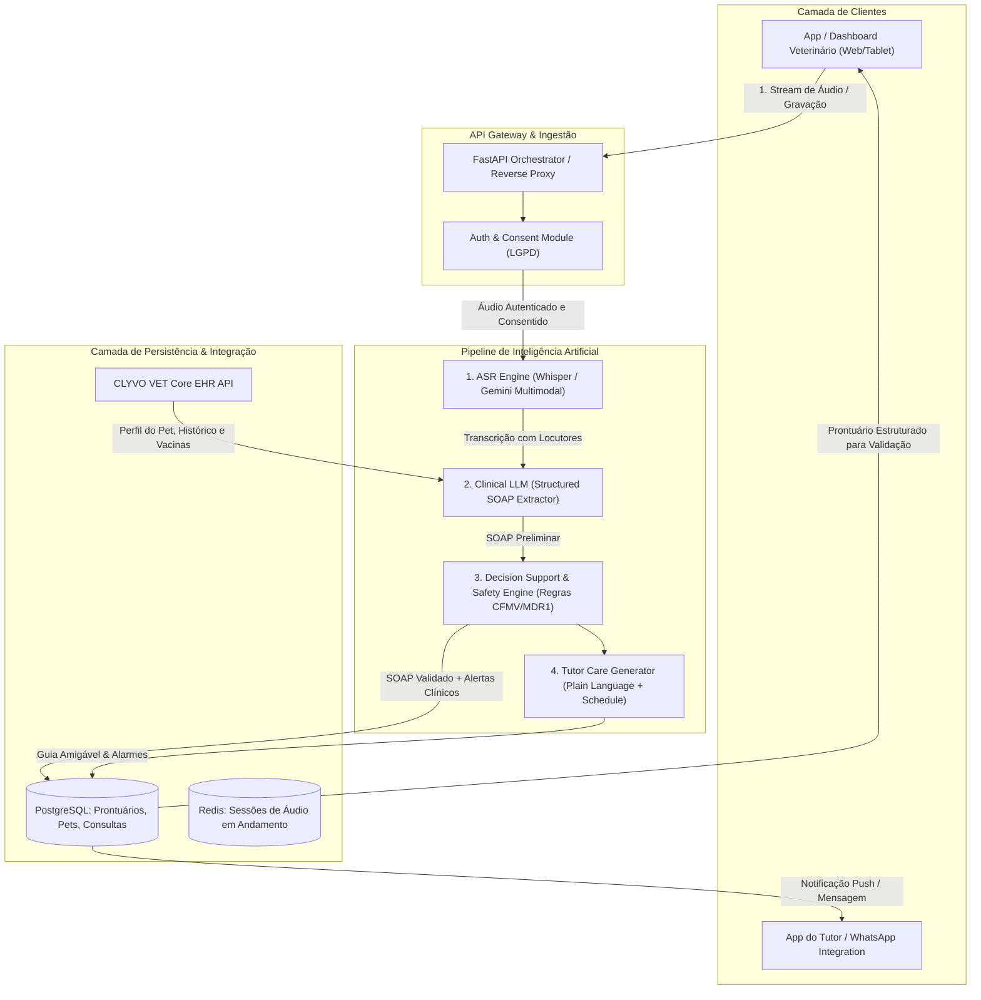
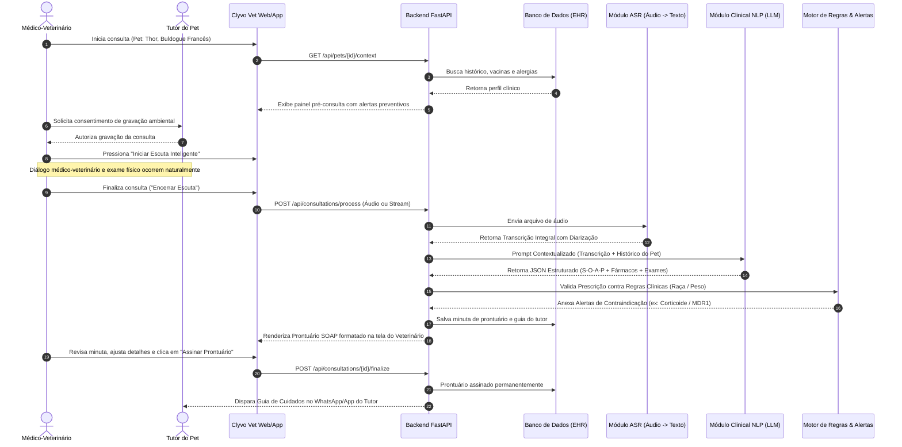

# Arquitetura Técnica do Sistema: ClyvoScribe AI (CLYVO VET)

## 1. Visão Geral da Arquitetura

O **ClyvoScribe AI** é concebido como um microsserviço inteligente de alta disponibilidade desacoplado da plataforma central **CLYVO VET**, comunicando-se via API RESTful e WebSockets para streaming de áudio e dados em tempo real.

A arquitetura adota o padrão **Clean Architecture** com separação explícita de responsabilidades:
- **Camada de Apresentação (Interface)**: Dashboard web e mobile para o Médico-Veterinário e aplicativo móvel / portal do Tutor.
- **Camada de Aplicação & Orquestração (API Gateway & Pipeline)**: Endpoints FastAPI com validação de tipos em Pydantic e fila assíncrona.
- **Camada de Inteligência Artificial (Inference Engine)**:
  - *ASR Engine*: Processamento de áudio acústico e conversão fonema-texto com diarização.
  - *Clinical NLP Engine*: Modelo generativo instruído para extração SOAP e estruturação de prescrições.
  - *Safety Guardrails*: Motor determinístico de regras de farmacovigilância e predisposição racial.
- **Camada de Persistência (Database & Cache)**: Banco relacional (PostgreSQL) para dados transacionais e prontuários; Redis para fila e cache de sessões ativas de áudio.

---

## 2. Diagrama Arquitetural de Componentes

---

## 3. Diagrama de Sequência e Fluxo de Dados Fim a Fim

O fluxo completo entre os usuários, a aplicação, os bancos de dados e os modelos de IA ocorre em seis etapas síncronas/assíncronas:

---

## 4. Estratégia de Resiliência e Operação Offline

Clínicas veterinárias frequentemente enfrentam oscilações de sinal de internet em salas de exame com blindagem ou subsolos. Para garantir operação ininterrupta:

1. **Local-First Audio Buffer (IndexedDB no Navegador / SQLite no App Mobile)**:
   - Os chunks de áudio são gravados e persistidos localmente no dispositivo durante a consulta em formato WebM/Opus comprimido.
   - Em caso de perda repentina de conexão, o áudio permanece íntegro na memória do cliente e é reenviado automaticamente assim que o link for restaurado.
2. **Fallback Híbrido de Modelos**:
   - *Modo Nuvem (Online)*: ASR via Whisper-Large / Gemini Multimodal com processamento assíncrono em GPU na nuvem.
   - *Modo Local / Borda (Edge Fallback)*: Para clínicas sem conexão externa estável, suporte à execução local do Whisper-Tiny / Small via ONNX Runtime na máquina da clínica.

---

## 5. Segurança da Informação, LGPD e Padrões Médicos

- **Criptografia Ponta a Ponta**: Áudios são trafegados via TLS 1.3 e armazenados em repouso com algoritmo AES-256.
- **Anonimização de PII (Personally Identifiable Information)**: O módulo de pré-processamento realiza higienização de nomes completos, CPFs, placas de carro ou números de cartão mencionados na consulta antes do envio ao motor generativo.
- **Padrão SOAP Padronizado**: Estruturação estrita de acordo com as normas da *American Animal Hospital Association (AAHA)* e do *Conselho Federal de Medicina Veterinária (CFMV)*.
